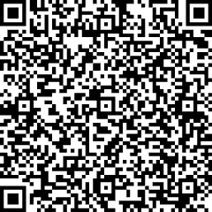

# Chroma结合Dmeta-embedding系列模型教程

Dmeta-embedding系列模型可轻松集成到Chroma生态中，我们提供**HTTP API**和**模型本地推理**两种方式集成。

## HTTP API
详见示例**chroma_API.py**

## 模型本地推理
我们提供sentence-transformers、langchain两种示例，详见**chroma_sentence-transformers.py、chroma_langchain.py**

## API申请
请扫描下方二维码，问卷只需要提交邮箱地址即可，稍后我们将尽快安排专员给您开通 API Key。

